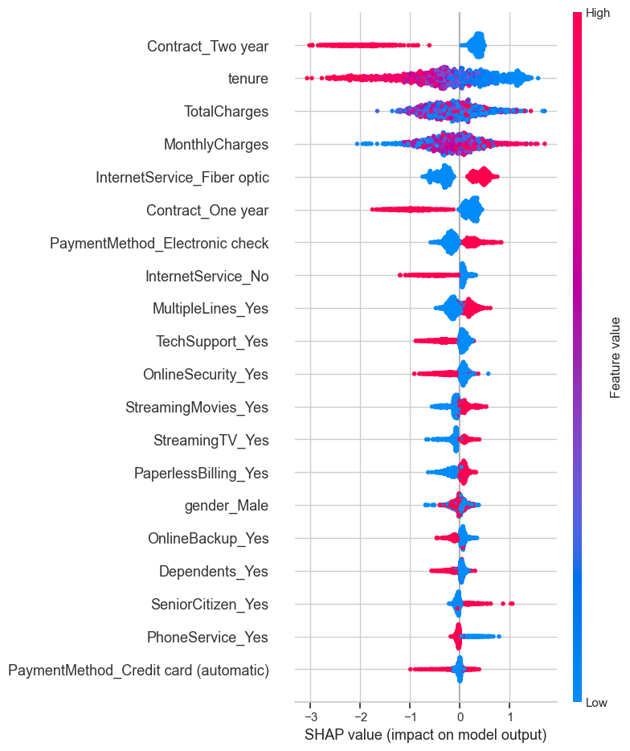
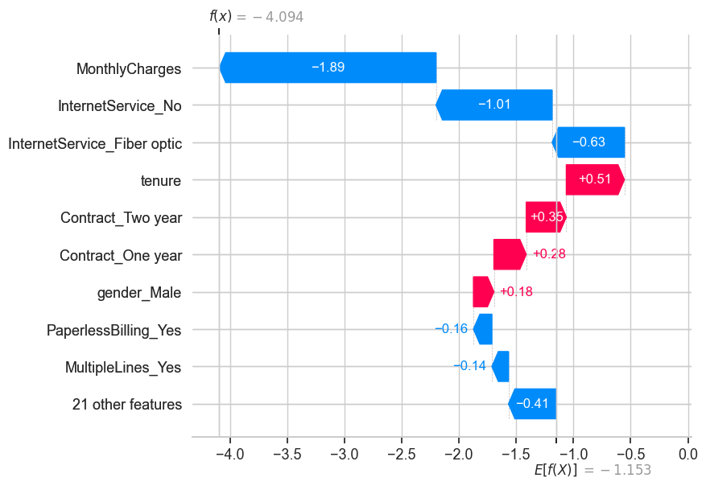

# 📉 Customer Churn Prediction

End-to-end machine learning project that predicts customer churn for a telecom company using real-world data. Includes feature engineering, model training, evaluation, and SHAP-based explainability.

---

## 🚀 Overview

> Predict which customers are likely to leave, and understand why.

- 📊 Cleaned and encoded 7,000+ records from IBM Telco Churn dataset
- 🧠 Trained Random Forest and XGBoost classifiers
- 🧪 Evaluated with Precision, Recall, F1, and ROC AUC
- 🔍 Interpreted predictions using SHAP (global + local explainability)

---

## 🧠 Models & Performance

| Model           | F1 Score (Churn) | ROC AUC |
|----------------|------------------|---------|
| Random Forest  | 0.55             | 0.82    |
| XGBoost        | 0.57             | 0.82    |

> XGBoost gave a slight lift in identifying churners.

---

## 🔍 Key Features Driving Churn



- Short tenure + high monthly charges = higher churn risk
- Longer-term contracts (1-2 years) reduce churn likelihood
- Fiber optic internet linked to higher churn

---

## 📈 Local Prediction Explanation



---

## 🌐 Live Demo

> Try the model in action via the Streamlit app:

[👉 Launch Churn Predictor App](https://nsikan56-customer-churn-prediction-streamlit-app-lqrnfe.streamlit.app)

Enter customer details and instantly predict churn likelihood.

---

## 🖥️ How to Run Locally

1. **Clone the repo**
```bash
git clone https://github.com/yourusername/customer_churn_prediction.git
```

2. **Install dependencies**
```bash
pip install -r requirements.txt
```

3. **Launch the app**
```bash
streamlit run streamlit_app.py
```

---

## 📂 Project Structure

```
Customer-Churn-Prediction/
│
├── WA_Fn-UseC_-Telco-Customer-Churn.csv        # Raw dataset
├── customer_churn_prediction.ipynb             # Jupyter notebook with full workflow
├── churn_data_cleaning.py                      # Script for data cleaning
├── requirements.txt                            # Dependencies
├── README.md                                    # Project overview and usage
├── shap-summary.png                             # SHAP summary plot
├── shap-waterfall.png                           # SHAP waterfall plot
```

---

## 🛠️ Tech Stack


---

## 📌 Next Steps (Optional)
- Deploy a Streamlit app to demo real-time churn prediction
- Add grid search or Optuna for hyperparameter tuning
- Compare SHAP with LIME for local explainability

---

## 📬 Contact

Made by [Nsikan](mailto:nsikanumoh56@gmail.com) — aspiring data scientist solving real-world business problems.